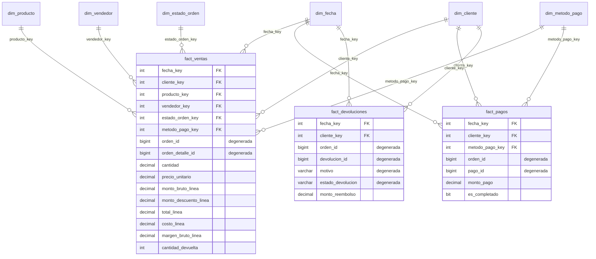

# Modelo Analítico (Star Schema) — Ventas

## Por qué este modelo

`t-sql/`, `postgreSQL/`, `mysql/` y `sqlite/` implementan un modelo **transaccional (OLTP)**: normalizado, optimizado para insertar/actualizar filas una por una (`orden_encabezado` + `orden_detalles`, claves foráneas por todos lados). Es el modelo correcto para que un sistema operacional registre ventas, pero es un mal modelo para que Power BI (o cualquier herramienta de BI) construya reportes: cada informe terminaría con 6-7 JOINs, las medidas (totales, márgenes) se recalculan en cada consulta, y agregar "ventas por trimestre" obliga a repetir lógica de fecha en cada reporte.

Este folder toma los datos que ya generaste en `t-sql/` y los transforma (ETL) en un **modelo dimensional tipo estrella (star schema)**, el diseño estándar de la industria para BI (Kimball). Es el mismo patrón que usarías si conectaras Power BI/Tableau directamente a una base: pocas tablas anchas, medidas pre-calculadas, una dimensión de fecha real, y cada tabla de hechos rodeada de sus dimensiones sin JOINs intermedios.

**Prerrequisito**: `t-sql/01-schema.sql`, `02-vistas-y-funciones.sql` y `03-generacion-datos.sql` ya ejecutados sobre la base `ventas_test`, con datos generados (`EXEC dbo.sp_generar_todos_los_datos ...`). Este modelo vive en una base **separada** (`ventas_bi`) y lee `ventas_test` por nombre de tres partes (`ventas_test.dbo.tabla`), el patrón habitual para separar la capa operacional de la capa analítica en el mismo servidor.

## El esquema

Es una **constelación de hechos** (fact constellation): tres tablas de hechos que comparten dimensiones conformadas (`dim_fecha` y `dim_cliente` se reutilizan en las tres). Cada tabla de hechos vive a su propio **grano** (nivel de detalle) — la decisión más importante de un modelo dimensional.



### Grano de cada tabla de hechos

| Tabla | Grano (qué es una fila) |
|---|---|
| `fact_ventas` | Una línea de una orden (un producto dentro de una orden) |
| `fact_pagos` | Un pago individual (una orden puede tener varios pagos parciales) |
| `fact_devoluciones` | Una devolución individual |

Definir el grano primero (antes de agregar una sola columna) es la regla de oro de Kimball: todo lo demás — qué dimensiones aplican, qué medidas tienen sentido — se deriva de ahí. `fact_ventas` está al grano más fino posible (línea de orden) a propósito: siempre podés sumar hacia arriba (por orden, por día, por mes), pero nunca podés "desagregar" datos que ya vinieron pre-sumados.

### Dimensiones

- **`dim_fecha`** — la dimensión más importante de cualquier modelo de BI. Sin ella, "ventas del último trimestre" requiere lógica de fechas en cada reporte; con ella, es un filtro. Generada con un CTE recursivo cubriendo el rango de fechas de los datos (no depende de que existan órdenes en cada día).
- **`dim_cliente`** — segmento, industria, tamaño de empresa, geografía (país/provincia/ciudad) desnormalizada. En Kimball esto se llama "achatar" (flatten) la dimensión: en vez de un esquema copo de nieve (snowflake) con `dim_geografia` separada, la geografía vive directo en `dim_cliente` porque casi siempre se filtra junto con el resto de atributos del cliente.
- **`dim_producto`** — categoría, subcategoría, marca desnormalizadas, mismo criterio.
- **`dim_vendedor`** — equipo, territorio, y el nombre del gerente ya resuelto (sin que el reporte tenga que hacer un self-join).
- **`dim_estado_orden`** — dimensión "basura" (junk dimension): combina `estado` + `estado_pago`, dos atributos de baja cardinalidad que casi siempre se filtran juntos. Evita meter 2 columnas de texto sueltas en la tabla de hechos.
- **`dim_metodo_pago`** — pequeña pero se reutiliza en `fact_ventas` y `fact_pagos` (dimensión conformada).

### La fila "Desconocido" (miembro -1)

`dim_vendedor` incluye una fila con `vendedor_key = -1` ("Sin vendedor asignado"). En el modelo OLTP, `orden_encabezado.vendedor_id` puede ser `NULL` (una venta sin vendedor asociado). Un `NULL` en una clave foránea de hechos rompe los `INNER JOIN` de las herramientas de BI y complica los cálculos de "% de ventas sin vendedor". La técnica estándar de Kimball es nunca dejar un `NULL` en una FK de hechos: se apunta a un miembro explícito "Desconocido" en la dimensión. Aplica el mismo patrón si en el futuro se necesita para clientes o productos inactivos que ya no existen en el OLTP.

### SCD (Slowly Changing Dimensions)

Las dimensiones acá son **Tipo 1** (sobrescriben el dato anterior, sin historia) — el ETL vuelve a correr y actualiza `dim_cliente`/`dim_producto`/`dim_vendedor` con el estado *actual* del OLTP. Es la opción correcta para este generador de datos de prueba porque el OLTP tampoco guarda historia de cambios (no hay forma de reconstruir "qué segmento tenía este cliente hace 6 meses"). Si se necesitara analizar, por ejemplo, "ventas por el segmento que tenía el cliente *al momento de la venta*" (Tipo 2), la extensión natural es agregar `valido_desde`, `valido_hasta`, `es_actual` a `dim_cliente` y versionar filas en el ETL en vez de hacer `UPDATE` — se deja como comentario en `02-etl-carga.sql` para no sobre-construir algo que estos datos de prueba no necesitan.

## Archivos

| Archivo | Contenido |
|---|---|
| `00-inicializa-bd.sql` | Crea la base `ventas_bi`, separada de `ventas_test` |
| `01-schema.sql` | DDL de las 6 dimensiones + 3 tablas de hechos |
| `02-etl-carga.sql` | Carga `dim_fecha` (generada), las demás dimensiones y los 3 hechos desde `ventas_test` |
| `03-queries-bi-ejemplo.sql` | Consultas típicas de dashboard: YoY, top N por dimensión, tendencia mensual, embudo de cobranza — todas sin un solo JOIN a tablas fuera del star schema |

## Uso

```sql
-- 1) Generar datos en el OLTP (una sola vez, o cuando se quiera refrescar)
--    ver t-sql/README implícito: 01-schema.sql, 02-vistas-y-funciones.sql, 03-generacion-datos.sql
--    EXEC dbo.sp_generar_todos_los_datos @clientes=500, @productos=200, @vendedores=50, @ordenes=5000, @dias_atras=365;

-- 2) Crear y poblar el modelo analítico
sqlcmd -S localhost -U sa -P '<password>' -C -i 00-inicializa-bd.sql
sqlcmd -S localhost -U sa -P '<password>' -C -d ventas_bi -i 01-schema.sql
sqlcmd -S localhost -U sa -P '<password>' -C -d ventas_bi -i 02-etl-carga.sql

-- 3) Conectar Power BI (u otra herramienta) a la base "ventas_bi" — no a "ventas_test"
```

En Power BI: importar las 9 tablas, marcar `dim_fecha` como tabla de fechas ("Mark as Date Table"), y las relaciones se autodetectan por nombre de columna (`*_key`). No hace falta escribir una sola medida DAX para tener "ventas por mes", "top 10 clientes" o "ventas por categoría" funcionando — están un filtro de distancia.
